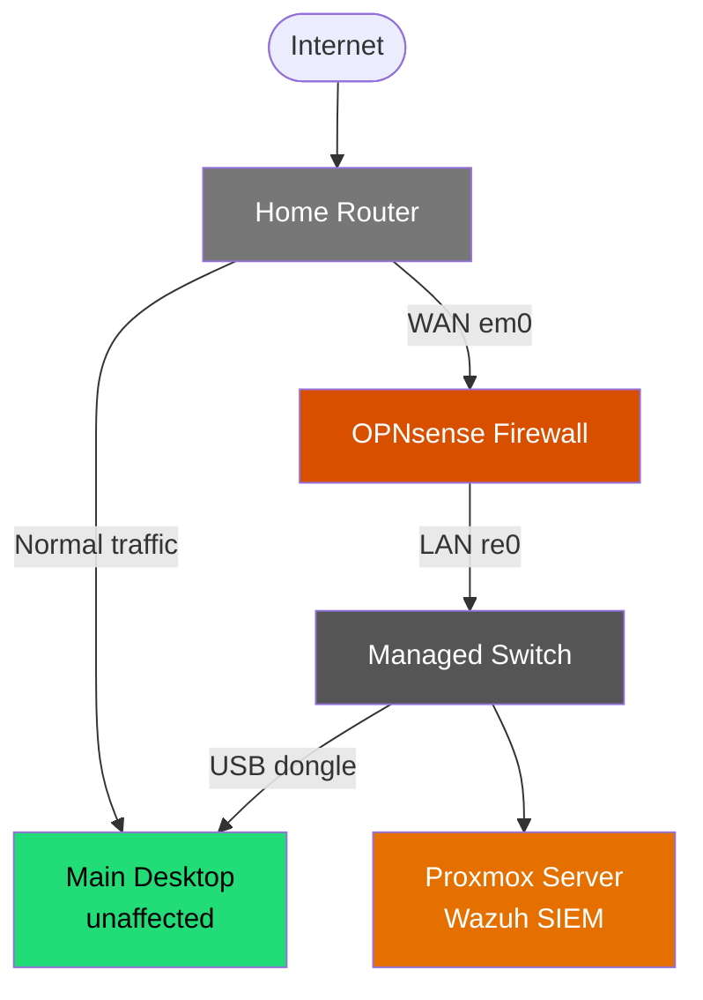

<div align="center">

 Isolated SOC Home Lab
### OPNsense Firewall · Proxmox Virtualization · Wazuh SIEM

*A self-built, network-isolated security lab for hands-on SOC analyst skill development.*


</div>

---

##  Table of Contents

- [Objective](https://github.com/DarvensleyE/Projects/blob/main/Isolated%20SOC%20Home%20Lab/README.md#objective)
- [Skills Learned](https://github.com/DarvensleyE/Projects/blob/main/Isolated%20SOC%20Home%20Lab/README.md#skills-learned)
- [Tools & Technologies Used](https://github.com/DarvensleyE/Projects/blob/main/Isolated%20SOC%20Home%20Lab/README.md#tools--technologies-used)
- [Network Architecture](https://github.com/DarvensleyE/Projects/blob/main/Isolated%20SOC%20Home%20Lab/README.md#network-architecture)
- [Build Walkthrough](https://github.com/DarvensleyE/Projects/blob/main/Isolated%20SOC%20Home%20Lab/README.md#build-walkthrough)
- [Challenges & Troubleshooting](https://github.com/DarvensleyE/Projects/blob/main/Isolated%20SOC%20Home%20Lab/README.md#challenges--troubleshooting)
- [Screenshots](https://github.com/DarvensleyE/Projects/blob/main/Isolated%20SOC%20Home%20Lab/README.md#screenshots)
- [Key Takeaways](https://github.com/DarvensleyE/Projects/blob/main/Isolated%20SOC%20Home%20Lab/README.md#key-takeaways)
- [Roadmap](https://github.com/DarvensleyE/Projects/blob/main/Isolated%20SOC%20Home%20Lab/README.md#roadmap)
- [Documentation](https://github.com/DarvensleyE/Projects/blob/main/Isolated%20SOC%20Home%20Lab/README.md#documentation)

---

##  Objective

I'm transitioning from **Service Desk / IT Support** into **Cybersecurity**, with a focus on SOC analyst and network defense work. I built this lab to get genuinely hands-on with the core infrastructure a SOC analyst needs to understand — not just how to use a SIEM, but how to build, segment, and secure the network it sits on.

**The goal:** build a network segment that is physically and logically isolated from my home network, where I could safely deploy and operate a SIEM, practice detection workflows, and eventually run malware analysis — without any risk to personal devices or home traffic.

This project demonstrates the full lifecycle of standing up security infrastructure from scratch: planning the network, installing and hardening a firewall, deploying a hypervisor and SIEM, and troubleshooting real failures along the way.

---

##  Skills Learned

- **Network segmentation** — designing a network boundary using physically separate interfaces and distinct subnets, rather than relying on a single flat network
- **Firewall administration** — installing OPNsense from scratch, assigning interfaces, configuring WAN/LAN policy, and managing DHCP scopes
- **Subnetting & IP planning** — choosing non-overlapping address ranges to avoid conflicts between an existing network and a new one
- **SIEM deployment** — installing and operating Wazuh (manager, indexer, dashboard) as a real, functioning detection platform
- **Virtualization administration** — provisioning and managing VMs in Proxmox, including live disk and LVM operations on a running system
- **Linux systems troubleshooting** — diagnosing failed services using `systemctl`, `journalctl`, and disk usage tools (`df`, `du`) to find and fix root causes
- **Security-first design thinking** — understanding and applying default-deny inbound policy, NAT boundaries, and the difference between "on the network" and "exposed to the internet"
- **Technical documentation** — writing architecture and setup docs clear enough for someone else to reproduce the build

---

## Tools & Technologies Used

| Category | Tool |
|---|---|
| Firewall / Router | **OPNsense** (FreeBSD-based) |
| Hypervisor | **Proxmox VE** |
| SIEM | **Wazuh** (manager, indexer, dashboard) |
| Guest OS | **Ubuntu Linux** |
| DHCP | **Kea DHCP** (via OPNsense) |
| Networking hardware | Mini PC (dual NIC: Intel + Realtek), managed switch, USB-to-Ethernet adapter |

---

##  Network Architecture



**Design principles:**
- The home network and the lab network are **physically separate** — OPNsense uses two distinct NICs, one facing the home router, one facing the lab switch.
- The lab subnet (`192.168.50.0/24`) is **intentionally distinct** from the home network's range to prevent address collisions.
- **Default-deny inbound** — nothing on the lab segment is reachable from the internet; no port-forwarding rules exist.
- A **dual-homed management desktop** (main NIC on the home network, USB-Ethernet adapter on the lab network) allows GUI access to both OPNsense and Proxmox without sacrificing normal internet access or merging the two networks.

Full breakdown of hardware, subnetting, and design rationale: **[ARCHITECTURE.md](./ARCHITECTURE.md)**

---

##  Build Walkthrough

This build happened in four phases, each documented in detail:

| Phase | What it covers |
|---|---|
| **[1. Proxmox Setup](https://github.com/DarvensleyE/Projects/blob/main/Isolated%20SOC%20Home%20Lab/Documents/Proxmox-Setup.md)** | Hypervisor installation, initial network bridge, VM sizing considerations |
| **[2. OPNsense Setup](https://github.com/DarvensleyE/Projects/blob/main/Isolated%20SOC%20Home%20Lab/ARCHITECTURE.md)** | Firewall installation, interface assignment, WAN/LAN config, DHCP, admin hardening |
| **[3. Wazuh SIEM Setup](https://github.com/DarvensleyE/Projects/blob/main/Isolated%20SOC%20Home%20Lab/Documents/Wazuh-SIEM-Setup.md)** | SIEM installation, a failed-service diagnosis, and a live disk/LVM resize |
| **[4. Connecting It All Together](https://github.com/DarvensleyE/Projects/edit/main/Isolated%20SOC%20Home%20Lab/Documents/Connecting-it-Together.md)** | Cabling, resolving a subnet mismatch, dual-homed management access, and verifying isolation |

Condensed quick-reference version of the whole build: **[SETUP.md](./SETUP.md)**

---

## Challenges & Troubleshooting

Real problems I hit during the build, and how I diagnosed and fixed each one:

### 1. Static IP subnet mismatch
**Problem:** Proxmox had been configured earlier with a static IP on a completely different subnet (left over from before OPNsense existed). After moving its cable to the new lab switch, it was unreachable.
**Fix:** Temporarily matched a management NIC to Proxmox's *old* subnet to reach its GUI one last time, then reconfigured its network bridge (`vmbr0`) to a static address on the new lab subnet, outside OPNsense's DHCP pool.
**Lesson:** Inserting a firewall into an existing network doesn't automatically re-point statically-configured devices — DHCP clients adapt automatically, static ones don't.

### 2. Wazuh manager failing to start
**Problem:** The Wazuh dashboard sat on "server is not ready yet" indefinitely. Investigation with `systemctl status wazuh-manager` showed a failed state.
**Diagnosis:** `journalctl -u wazuh-manager -e --no-pager` combined with `df -h` revealed the VM's disk was completely full — Wazuh's indexer component (OpenSearch-based) is disk-intensive and the VM had been under-provisioned.
**Fix:** Resized the VM's virtual disk in Proxmox, then extended the Linux LVM volume and filesystem live, without reinstalling anything:
```bash
sudo pvresize /dev/sda3
sudo lvextend -l +100%FREE /dev/mapper/ubuntu--vg-ubuntu--lv
sudo resize2fs /dev/mapper/ubuntu--vg-ubuntu--lv
```
**Lesson:** Size SIEM/indexer VMs generously from the start (50GB+ disk) — resizing live works, but sizing correctly up front avoids the outage entirely.

Full troubleshooting reference, including commands for every scenario: **[SETUP.md → Troubleshooting](https://github.com/DarvensleyE/Projects/blob/main/Isolated%20SOC%20Home%20Lab/SETUP.md#troubleshooting)**

---

##  Screenshots
> - OPNsense dashboard after initial setup


> - Interface assignment / WAN-LAN configuration screen


> - Kea DHCP configuration


> - Proxmox node overview and Wazuh VM


> - Wazuh dashboard home screen


> - Firewall rules


```
docs/screenshots/
├── opnsense-dashboard.png
├── interface-assignment.png
├── dhcp-leases.png
├── proxmox-overview.png
└── wazuh-dashboard.png
```

Reference them in this README once added, e.g.:
```markdown

```

---

##  Key Takeaways

- Physical network segmentation is a reliable, understandable way to isolate risk — and a good foundation before moving to more complex VLAN-based segmentation.
- NAT and default-deny inbound rules do most of the heavy lifting for keeping a lab private, without needing complex rule sets.
- Real infrastructure work means hitting real failures — disk space, subnet mismatches, service crashes — and this project is as much about the troubleshooting process as the end result.
- Documentation written *during* the build, not after, makes the final writeup far more accurate and useful to others.

---

##  Roadmap

- [x] OPNsense deployed as a standalone, isolated firewall
- [x] Proxmox and Wazuh running behind it on a dedicated subnet
- [ ] VLAN segmentation to merge home and lab traffic onto one physical firewall, with explicit inter-VLAN deny rules
- [ ] Suricata IDS/IPS integration feeding alerts into Wazuh
- [ ] Controlled malware detonation environment for detection rule testing

---

##  Documentation

| Doc | Description |
|---|---|
| [`ARCHITECTURE.md`](./ARCHITECTURE.md) | Full network topology, hardware list, subnetting, and design rationale |
| [`SETUP.md`](./SETUP.md) | Complete step-by-step build guide with every command used, plus troubleshooting |

